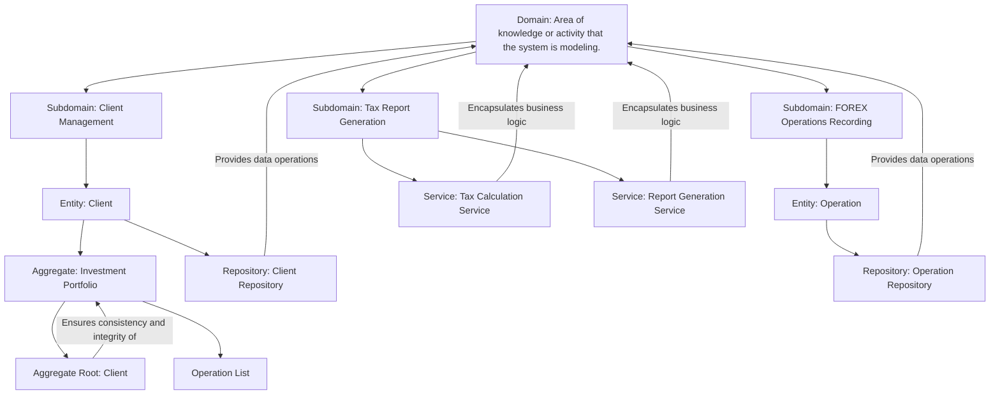

# SPEC-1: Tax Calculation Solution for FOREX Investments

## Objectives

- [ ] Practice English

## Context

The client requires a solution to calculate the tax amount owed by their customers who invest in FOREX. The solution should include the management of the customers' investment portfolios and provide the final tax amount due, also considering other investments.

## Requirements

### Mandatory Requirements:

#### `Customer` Records

- **Insert** new customer records.
- **Consult** existing customer records.
- **Update** customer records.
- **Delete** customer records.

#### `Operation` Records:

- **Insert** new operation records.
- **Consult** existing operation records.
- **Update** operation records.
- **Delete** operation records.

#### `Report` Generation:

- Ability to send reports to customers or allow customers to consult their reports.
- Calculation of tax for the current month and accumulated.

### Desirable Requirements:

- An elegant presentation of data to improve customer relationships.

#### Optional Requirements:

- Additional analyses and insights related to investments.

## Excluded Requirements:

- Any non-critical functionalities that do not directly contribute to tax calculation or report generation.
  Urgency

## Questions:

- Data Sources and Integration: What are the data sources for the investments, and how will we integrate with them? Will they be provided via APIs, databases, or manual uploads?

- Regulatory Requirements: Are there specific regulations or calculations we need to follow? If so, can you provide the details or references?

## Domain Structure and Bounded Contexts

### Main Domain: Tax Calculation System for FOREX Investments

| Subdomains                 |
| -------------------------- |
| Client Management          |
| FOREX Operations Recording |
| Tax Report Generation      |

### Identification of Entities and Aggregates

#### Entity Client

Attributes:

| Attributes | Description                                                         |
| ---------- | ------------------------------------------------------------------- |
| ID         | Unique identifier of the client (UUID)                              |
| Name       | Full name of the client                                             |
| CPF        | Cadastro de Pessoa Física, a unique identification number in Brazil |
| Email      | Client's email address                                              |
| Address    | Client's residential address                                        |

Behaviors:

| Behaviors    | Description                                       |
| ------------ | ------------------------------------------------- |
| updateData() | Allows updating the client's registration data    |
| delete()     | Removes the client's registration from the system |

---

#### Entity Operation

Attributes:

| Attributes | Description                                                 |
| ---------- | ----------------------------------------------------------- |
| ID         | Unique identifier of the operation (UUID)                   |
| Type       | Type of operation (Buy/Sell)                                |
| Date       | Date the operation was performed                            |
| Value      | Monetary value of the operation                             |
| Currency   | Currency used in the operation                              |
| ClientID   | Identifier of the client who performed the operation (UUID) |

Behaviors:

| Behaviors | Description                   |
| --------- | ----------------------------- |
| insert()  | Adds a new operation          |
| update()  | Updates an existing operation |
| delete()  | Removes an operation          |

---

#### Investment Portfolio Aggregate

Elements:

| Elements       | Description                           |
| -------------- | ------------------------------------- |
| Aggregate Root | Client (main entity of the aggregate) |
| Operation List | Financial operations of the client    |

Behaviors:

| Behaviors          | Description                                                       |
| ------------------ | ----------------------------------------------------------------- |
| addOperation()     | Adds an operation to the client's portfolio                       |
| removeOperation()  | Removes an operation from the client's portfolio                  |
| calculateBalance() | Calculates the total balance of the client's investment portfolio |

---

## Definition of Services

### Tax Calculation Service

Methods:

| Methods                   | Description                              |
| ------------------------- | ---------------------------------------- |
| calculateMonthlyTax()     | Calculates the tax due monthly           |
| calculateAccumulatedTax() | Calculates the accumulated tax over time |

Business Rules:

| Business Rules    | Description                                         |
| ----------------- | --------------------------------------------------- |
| FOREX Regulations | Based on specific regulations for FOREX investments |

---

### Report Generation Service

Methods:

| Methods             | Description                                           |
| ------------------- | ----------------------------------------------------- |
| generatePDF()       | Generates a report in PDF format                      |
| sendEmail()         | Sends the report by email to the client               |
| generateDashboard() | Creates an interactive dashboard with the report data |

Business Rules:

| Business Rules  | Description                                                               |
| --------------- | ------------------------------------------------------------------------- |
| Data Formatting | Guidelines defining how data should be formatted and presented to clients |

---

## Definition of Repositories

### Client Repository

Methods:

| Methods         | Description                                         |
| --------------- | --------------------------------------------------- |
| saveClient()    | Saves client data in the system                     |
| getClientById() | Retrieves client data using their unique identifier |
| updateClient()  | Updates existing client data                        |
| deleteClient()  | Removes client data from the system                 |

### Operation Repository

Methods:

| Methods            | Description                                          |
| ------------------ | ---------------------------------------------------- |
| saveOperation()    | Saves operation data in the system                   |
| getOperationById() | Retrieves operation data using its unique identifier |
| updateOperation()  | Updates existing operation data                      |
| deleteOperation()  | Removes operation data from the system               |

## Concepts and Their Correlations

| Concept        | Explanation                                                                                                                                                                    | Correlations                                                                                                 |
| -------------- | ------------------------------------------------------------------------------------------------------------------------------------------------------------------------------ | ------------------------------------------------------------------------------------------------------------ |
| Domain         | Area of knowledge or activity that the system is modeling. Example: Tax Calculation for FOREX investments.                                                                     | Encompasses various functional areas (subdomains), each with specific responsibilities.                      |
| Subdomain      | Specific divisions within the main domain focusing on particular aspects. Example: Client Management, FOREX Operations Recording, and Tax Report Generation.                   | Each subdomain addresses a specific functionality of the system.                                             |
| Entity         | A real-world object with a distinct identity. Example: Client and Operation.                                                                                                   | Represent real-world objects with unique identities and specific behaviors.                                  |
| Aggregate      | A group of entities treated as a cohesive unit. Example: Investment Portfolio.                                                                                                 | Form a unit of consistency and integrity.                                                                    |
| Aggregate Root | Maintains the integrity of the aggregate and controls the other entities within it. Example: Client in the Investment Portfolio.                                               | Ensures the consistency and integrity of aggregate elements.                                                 |
| Service        | Component that encapsulates business logic or operations that do not belong to a specific entity or aggregate. Example: Tax Calculation Service and Report Generation Service. | Perform specific business logic and operations, separated from entities and aggregates.                      |
| Repository     | A design pattern providing an interface for performing storage, retrieval, and search operations on entities. Example: Client Repository and Operation Repository.             | Offer a means to store, retrieve, and manage entities, maintaining data integrity in the system.             |
| Aggregate Root | The main entity within an aggregate that controls the consistency and integrity of other entities. Example: Client in the Investment Portfolio.                                | Ensures the consistency and integrity of aggregate elements.                                                 |
| Services       | Perform business logic that does not belong to a specific entity or aggregate, such as calculating taxes or generating reports.                                                | Encapsulate business logic and operations, providing specific functionalities for the system.                |
| Repositories   | Provide a means to store, retrieve, and manage entities, supporting the necessary operations to maintain data integrity in the system.                                         | Offer an interface for interacting with data, separating persistence logic from the system's business logic. |

---

---

```mermaid
graph TD;
    KnowledgeRepository["KnowledgeRepository"]
    KnowledgeRepository --> index["index.md"]
    KnowledgeRepository --> applied-knowledge["applied-knowledge/"]
    KnowledgeRepository --> intangibles["intangibles/"]
    KnowledgeRepository --> tangibles["tangibles/"]
    KnowledgeRepository --> concepts["concepts/"]
    KnowledgeRepository --> vocabularies["vocabularies/"]

    applied-knowledge --> technology-and-useful-arts["technology-and-useful-arts/"]
    applied-knowledge --> spec-1["spec-1/"]
    applied-knowledge --> applied-knowledge-meta["applied-knowledge.md"]

    spec-1 --> spec-1-index["index.md"]
    spec-1 --> objectives["objectives.md"]
    spec-1 --> context["context.md"]
    spec-1 --> requirements["requirements/"]
    spec-1 --> urgency["urgency.md"]
    spec-1 --> questions["questions.md"]
    spec-1 --> domain-structure-and-bounded-contexts["domain-structure-and-bounded-contexts/"]
    spec-1 --> quests["quests/"]
    spec-1 --> spec-1-meta["spec-1.md"]

    requirements --> mandatory-requirements["mandatory-requirements.md"]
    requirements --> desirable-requirements["desirable-requirements.md"]
    requirements --> optional-requirements["optional-requirements.md"]
    requirements --> excluded-requirements["excluded-requirements.md"]
    requirements --> requirements-meta["requirements.md"]

    domain-structure-and-bounded-contexts --> main-domain["main-domain.md"]
    domain-structure-and-bounded-contexts --> identification-of-entities-and-aggregates["identification-of-entities-and-aggregates.md"]
    domain-structure-and-bounded-contexts --> definition-of-services["definition-of-services.md"]
    domain-structure-and-bounded-contexts --> definition-of-repositories["definition-of-repositories.md"]
    domain-structure-and-bounded-contexts --> concepts-and-their-correlations["concepts-and-their-correlations.md"]
    domain-structure-and-bounded-contexts --> domain-structure-and-bounded-contexts-meta["domain-structure-and-bounded-contexts.md"]

    quests --> main-quests["main-quests.md"]
    quests --> side-quests["side-quests.md"]
    quests --> quests-meta["quests.md"]

    technology-and-useful-arts --> client-management["client-management.md"]
    technology-and-useful-arts --> forex-operations-recording["forex-operations-recording.md"]
    technology-and-useful-arts --> tax-report-generation["tax-report-generation.md"]
    technology-and-useful-arts --> concepts["concepts/"]
    technology-and-useful-arts --> entities["entities/"]
    technology-and-useful-arts --> repositories["repositories/"]
    technology-and-useful-arts --> services["services/"]
    technology-and-useful-arts --> technology-and-useful-arts-meta["technology-and-useful-arts.md"]

    concepts --> domain["domain.md"]
    concepts --> subdomain["subdomain.md"]
    concepts --> entity["entity.md"]
    concepts --> aggregate["aggregate.md"]
    concepts --> aggregate-root["aggregate-root.md"]
    concepts --> service["service.md"]
    concepts --> repository["repository.md"]
    concepts --> services["services.md"]
    concepts --> repositories["repositories.md"]
    concepts --> general-concepts["general-concepts.md"]
    concepts --> concepts-meta["concepts.md"]

    entities --> client["client.md"]
    entities --> operation["operation.md"]
    entities --> investment-portfolio-aggregate["investment-portfolio-aggregate.md"]
    entities --> entities-meta["entities.md"]

    repositories --> client-repository["client-repository.md"]
    repositories --> operation-repository["operation-repository.md"]
    repositories --> repositories-meta["repositories.md"]

    services --> tax-calculation-service["tax-calculation-service.md"]
    services --> report-generation-service["report-generation-service.md"]
    services --> services-meta["services.md"]

    intangibles --> ontology["ontology/"]
    intangibles --> mathematics["mathematics/"]
    intangibles --> mysticism["mysticism/"]
    intangibles --> mentalogy["mentalogy/"]
    intangibles --> intangibles-meta["intangibles.md"]

    ontology --> existence["existence.md"]
    ontology --> ontology-meta["ontology.md"]

    mathematics --> measurement["measurement.md"]
    mathematics --> mathematics-meta["mathematics.md"]

    mysticism --> concept["concept.md"]
    mysticism --> mysticism-meta["mysticism.md"]

    mentalogy --> mentality["mentality.md"]
    mentalogy --> mentalogy-meta["mentalogy.md"]

    tangibles --> physics["physics/"]
    tangibles --> chemistry["chemistry/"]
    tangibles --> astronomy["astronomy/"]
    tangibles --> geology["geology/"]
    tangibles --> biology["biology/"]
    tangibles --> anthropology["anthropology/"]
    tangibles --> tangibles-meta["tangibles.md"]

    physics --> performance["performance.md"]
    physics --> physics-meta["physics.md"]

    chemistry --> matter["matter.md"]
    chemistry --> chemistry-meta["chemistry.md"]

    astronomy --> gross-bodies["gross-bodies.md"]
    astronomy --> astronomy-meta["astronomy.md"]

    geology --> the-earth["the-earth.md"]
    geology --> geology-meta["geology.md"]

    biology --> life-forms["life-forms.md"]
    biology --> biology-meta["biology.md"]

    anthropology --> manufacture["manufacture.md"]
    anthropology --> anthropology-meta["anthropology.md"]

    concepts --> system-thinker-tools["system-thinker-tools/"]
    concepts --> extracted-concepts["extracted-concepts/"]
    concepts --> general-concepts["general-concepts.md"]
    concepts --> concepts-meta["concepts.md"]

    system-thinker-tools --> parts["parts.md"]
    system-thinker-tools --> wholes["wholes.md"]
    system-thinker-tools --> linear["linear.md"]
    system-thinker-tools --> non-linear["non-linear.md"]
    system-thinker-tools --> structures["structures.md"]
    system-thinker-tools --> processes["processes.md"]
    system-thinker-tools --> hierarchies["hierarchies.md"]
    system-thinker-tools --> networks["networks.md"]
    system-thinker-tools --> analysis["analysis.md"]
    system-thinker-tools --> synthesis["synthesis.md"]
    system-thinker-tools --> objects["objects.md"]
    system-thinker-tools --> relationships["relationships.md"]
    system-thinker-tools --> system-thinker-tools-meta["system-thinker-tools.md"]

    extracted-concepts --> functional-areas["functional-areas.md"]
    extracted-concepts --> responsibilities["responsibilities.md"]
    extracted-concepts --> real-world-objects["real-world-objects.md"]
    extracted-concepts --> unique-identities["unique-identities.md"]
    extracted-concepts --> specific-behaviors["specific-behaviors.md"]
    extracted-concepts --> units-of-consistency-and-integrity["units-of-consistency-and-integrity.md"]
    extracted-concepts --> business-logic["business-logic.md"]
    extracted-concepts --> storage-operations["storage-operations.md"]
    extracted-concepts --> search-operations["search-operations.md"]
    extracted-concepts --> data-integrity["data-integrity.md"]
    extracted-concepts --> extracted-concepts-meta["extracted-concepts.md"]

    vocabularies --> applied-knowledge-vocab["applied-knowledge/"]
    vocabularies --> intangibles-vocab["intangibles/"]
    vocabularies --> tangibles-vocab["tangibles/"]
    vocabularies --> system-thinker-tools-vocab["system-thinker-tools/"]
    vocabularies --> extracted-concepts-vocab["extracted-concepts/"]
    vocabularies --> vocabularies-meta["vocabularies.md"]

    applied-knowledge-vocab --> domain-vocab["domain.md"]
    applied-knowledge-vocab --> subdomain-vocab["subdomain.md"]
    applied-knowledge-vocab --> entity-vocab["entity.md"]
    applied-knowledge-vocab --> aggregate-vocab["aggregate.md"]
    applied-knowledge-vocab --> aggregate-root-vocab["aggregate-root.md"]
    applied-knowledge-vocab --> service-vocab["service.md"]
    applied-knowledge-vocab --> repository-vocab["repository.md"]
    applied-knowledge-vocab --> services-vocab["services.md"]
    applied-knowledge-vocab --> repositories-vocab["repositories.md"]
    applied-knowledge-vocab --> applied-knowledge-vocab-meta["applied-knowledge.md"]

    intangibles-vocab --> existence-vocab["existence.md"]
    intangibles-vocab --> measurement-vocab["measurement.md"]
    intangibles-vocab --> concept-vocab["concept.md"]
    intangibles-vocab --> mentality-vocab["mentality.md"]
    intangibles-vocab --> intangibles-vocab-meta["intangibles.md"]

    tangibles-vocab --> performance-vocab["performance.md"]
    tangibles-vocab --> matter-vocab["matter.md"]
    tangibles-vocab --> gross-bodies-vocab["gross-bodies.md"]
    tangibles-vocab --> the-earth-vocab["the-earth.md"]
    tangibles-vocab --> life-forms-vocab["life-forms.md"]
    tangibles-vocab --> manufacture-vocab["manufacture.md"]
    tangibles-vocab --> tangibles-vocab-meta["tangibles.md"]

    system-thinker-tools-vocab --> parts-vocab["parts.md"]
    system-thinker-tools-vocab --> wholes-vocab["wholes.md"]
    system-thinker-tools-vocab --> linear-vocab["linear.md"]
    system-thinker-tools-vocab --> non-linear-vocab["non-linear.md"]
    system-thinker-tools-vocab --> structures-vocab["structures.md"]
    system-thinker-tools-vocab --> processes-vocab["processes.md"]
    system-thinker-tools-vocab --> hierarchies-vocab["hierarchies.md"]
    system-thinker-tools-vocab --> networks-vocab["networks.md"]
    system-thinker-tools-vocab --> analysis-vocab["analysis.md"]
    system-thinker-tools-vocab --> synthesis-vocab["synthesis.md"]
    system-thinker-tools-vocab --> objects-vocab["objects.md"]
    system-thinker-tools-vocab --> relationships-vocab["relationships.md"]
    system-thinker-tools-vocab --> system-thinker-tools-vocab-meta["system-thinker-tools.md"]

    extracted-concepts-vocab --> functional-areas-vocab["functional-areas.md"]
    extracted-concepts-vocab --> responsibilities-vocab["responsibilities.md"]
    extracted-concepts-vocab --> real-world-objects-vocab["real-world-objects.md"]
    extracted-concepts-vocab --> unique-identities-vocab["unique-identities.md"]
    extracted-concepts-vocab --> specific-behaviors-vocab["specific-behaviors.md"]
    extracted-concepts-vocab --> units-of-consistency-and-integrity-vocab["units-of-consistency-and-integrity.md"]
    extracted-concepts-vocab --> business-logic-vocab["business-logic.md"]
    extracted-concepts-vocab --> storage-operations-vocab["storage-operations.md"]
    extracted-concepts-vocab --> search-operations-vocab["search-operations.md"]
    extracted-concepts-vocab --> data-integrity-vocab["data-integrity.md"]
    extracted-concepts-vocab --> extracted-concepts-vocab-meta["extracted-concepts.md"]

```

### [[Subdomains]]

### [[Entities and Aggregates]]

### [[Services]]

### [[Repositories]]

### [[General Concepts]]
